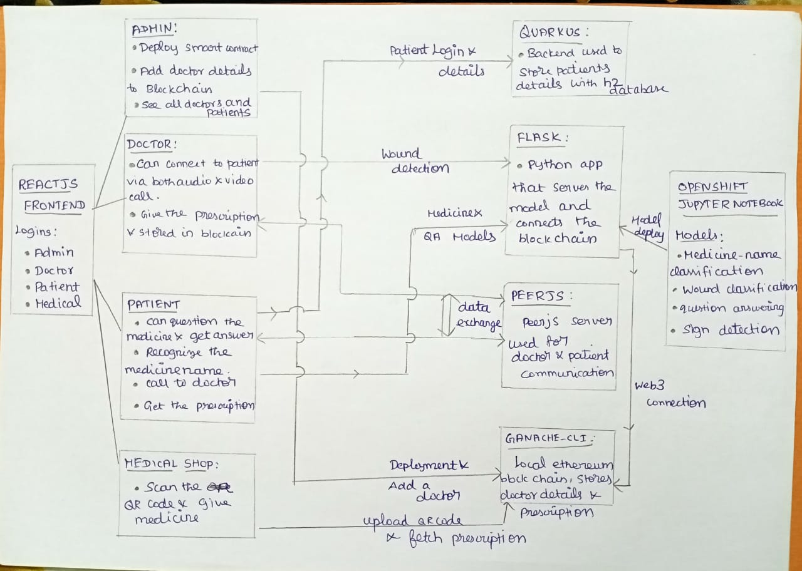

# Deploying the project on openshift cluster:

Locally test os : Ubuntu(22.04)
Processor : i3(7th gen) and i7(11th gen)

# Architectural Diagram:

# Deploying Ganache-cli:

=> Inside the folder called yaml_files/, we can find the file "ganache.yml"
=> Copy the contents of that file and go to the Redhat developer sandbox, and login
=> In the topology page, you can find the "+" symbol in top, click it
=> Paste that yml content and click create.
=> It will pull image and creat the container.
=> Create the route, go to Administrator->Networking->Route
=> Create the route for the service we created(for ganache).
=> That's it we deployed Ganache Ethereum blockchain in openshift container.

# Deploying the Quarkus(Java backend):

=> Clone the repository locally.
=> For deploying this, I personally downloaded the openhift local and installed using the documentation.
=> Then, using the "OC" command, login to the developer sandbox.
=> Once we logged in, go to the java_backend folder, 
=> run command "mvn clean install" and "mvn package". All the configurations done in applications.properties file.
=> These two commands install dependecies and deploy to the openshift.
=> If route not created, create it.

# Deploying the Flask(Python Backend):

=> Clone the repository locally.
=> You can see the folder called "sc", which is nothing but smart contracts, written in Solidity.
=> Inside that SC folder, file called "script.sh" file run that. if it not running, give permission "chmod +x script.sh". 
=> Make sure installed the truffle. "npm install -g truffle" or "sudo install -g truffle" 
=> Before deploying python backend, you can find a file name called  "envfile", inside the python folder. Please update the file with the deployed ganache-cli route path.
    Otherwise, lead to error,  and commit to git
=> For deploying this, go to the webconsole of your developer sandbox.
=> In the left top corner, we have the "+Add" button and select import from git option.
=> Copy this repo url and paste, there.
=> Click advanced git options
=> In the context dir, type "/python". It will detect images.
=> Click "Edit import Strategy" and select latest version.
=> Fill Application Name, Name, Resource type as "Deployment", and target port as 8080, and check the "Create Route" and then click Create.
=> That's it, it will build and run.

# Deploying the React JS(Frontend):

=> Before Deploying this, find the .env file in react_frontend folder, and fill
    REACT_APP_BACKEND_URL= deployed python backend route + "/api"
    REACT_APP_JAVA_BACKEND_URL=" deployed java backedn route + "/patients"

    and commit to git
=> For deploying this, go to the webconsole of your developer sandbox.
=> In the left top corner, we have the "+Add" button and select import from git option.
=> Copy this repo url and paste, there.
=> Click advanced git options
=> In the context dir, type "/react_frontend". It will detect images.
=> Click "Edit import Strategy" and select latest version.
=> Fill Application Name, Name, Resource type as "Deployment", and target port as 8080, and check the "Create Route" and then click Create.
=> That's it, it will build and run.

# Project Overview :

    This project is basically about Online Pharmacy with Blockchain. Blockchain has the capability to revolutionize the medical industry. So, me as a team, decided to
    develope this project to deliver the people with highly confidential over their data and privacy. Because blockchain is highly secure.

    And I trained four models, medicine name recognition, Wound recognition, and Question and Answering model and finally Sign detection using tensorflow.js. All the other three are trained and quantized with intel openvio.

    In this project, we only stores the doctor's details in blockchain(that is mandatory), and Patients details in H2 database which is running in Quarkus.

    For blockchain, I used Ganache local blockchain,, which is light and highly performable.

    First, we have four main people in pharmacy,
        => Admin : Who controls the data over a network. And, can deploy the smart contract, and all doctor's details to blockchain, so that people can trust the doctor.
                    Doctor's password always will be their email + "@12345"
        => Doctor : Doctor can connect to the patient via video, chat. And, he can give prescription in the form of QR code.
        => Patient : Patient can connect to doctor via video chat. They can recognize the doctor's Precription form. Because, doctor's handwriting are always not known.
                    And, they can ask the question answer about the symptoms and medicines.
        => Medical shop : Some times, in local medical shop, they denied to give as medicines without proper doctor's prescription. But I resolved this issue by generating the blockchain transaction QR code and the medical shop member can scan and verify the doctor's signature.

# Architecture Overview :
    Regarding Architecture, I used,
    1. Python Flask
    2. Quarkus
    3. Ganache Ethereum blockchain
    4. Peerjs Server
    5. ReactJs

    Regarding PeerJs server, that is not deployed in openshift, I used already cloud hosted one. Sometimes, it keeps down. If that happens, Call funtion will not work.
    So please, if it failes, keep looking https://status.peerjs.com/

when start with admin page, it will ask for CID for medicine names. cid will be => QmPzoqWhDxgVhwyFAj638LQReXuZUtLByoBE6VUEDJAudg. This wont change.